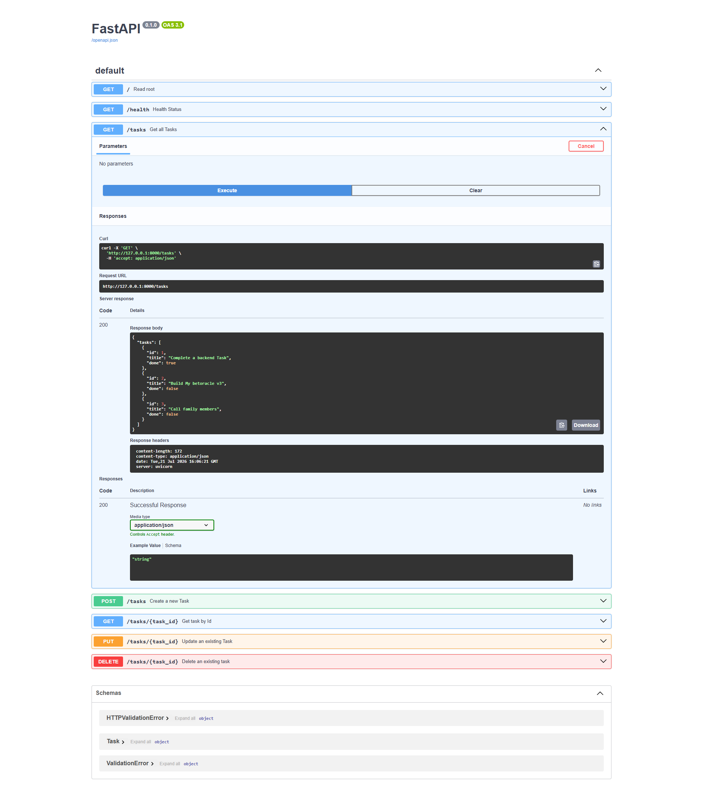

# Flyrank Todo API

A simple FastAPI task manager for learning REST API basics with Python. It exposes endpoints to create, list, view, update, and delete tasks in memory.

## What this is

This project is a small todo-style API built with:

- FastAPI for the web API
- Pydantic for request and response models
- Python for the application logic

The tasks are stored in memory while the server is running, so data resets when the app restarts.

## Install and run

Create and activate a virtual environment, then install the project dependencies:

```bash
python -m venv .venv
source .venv/bin/activate
pip install "fastapi[standard]"
```

Run the app with:

```bash
fastapi dev
```

Once the app is running, open:

- Swagger UI: http://127.0.0.1:8000/docs

## Endpoints

| Method | Path | Description |
| --- | --- | --- |
| GET | / | Returns API information |
| GET | /health | Returns health status |
| GET | /tasks | Returns all tasks |
| GET | /tasks/{task_id} | Returns one task by id |
| POST | /tasks | Creates a new task |
| PUT | /tasks/{task_id} | Updates an existing task |
| DELETE | /tasks/{task_id} | Deletes a task |

## Example request

```bash
curl -i http://127.0.0.1:8000/tasks
```

Example response:

```http
HTTP/1.1 200 OK
content-type: application/json

{"tasks":[{"id":1,"title":"Complete a backend Task","done":true},{"id":2,"title":"Build My betoracle v3","done":false},{"id":3,"title":"Call family members","done":false}]}
```

## Swagger screenshot


